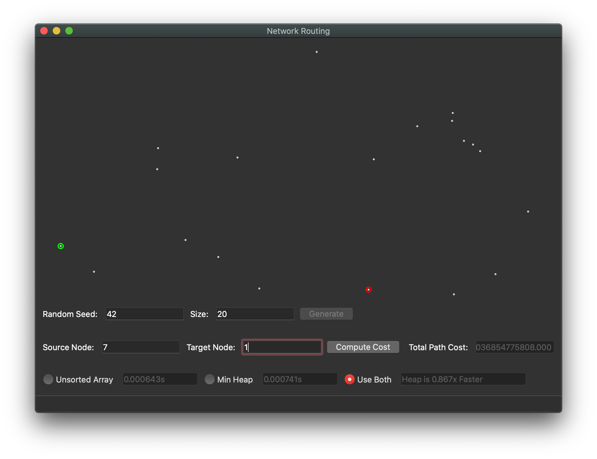
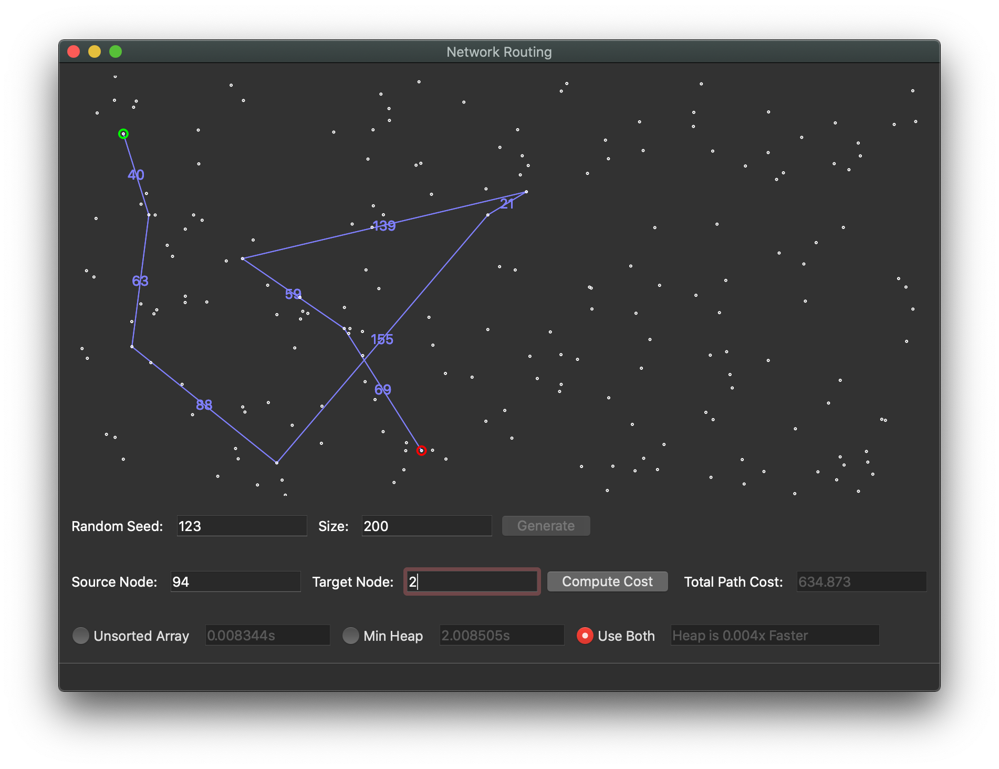

# Project 3
## Jacob Searle

### Part 1:
```python
#!/usr/bin/python3
import sys
from abc import abstractmethod
from cs312_graph import *
import time


class NetworkRoutingSolver:
    network = None
    dest = None
    source = None
    algo = None

    def __init__(self):
        pass

    def init_network(self, network):
        assert (type(network) == cs312_graph)
        self.network = network

    def get_shortest_path(self, destIndex):
        self.dest = destIndex
        total_length, path_edges = self.algo.get_shortest_path_to(destIndex)
        return {'cost': total_length, 'path': path_edges}

    def compute_shortest_paths(self, srcIndex, use_heap=False):
        self.source = srcIndex
        t1 = time.time()
        self.algo = DijkstrasAlgorithm(use_heap, self.network, srcIndex)
        t2 = time.time()
        return t2 - t1


class DijkstrasAlgorithm:
    priority_queue = None
    network: cs312_graph = None
    source_index = None
    dist = None
    prev = None

    # Initialize
    def __init__(self, use_heap, network, source_index):
        self.network = network
        self.source_index = source_index
        if use_heap:
            self.priority_queue = BinaryHeap()
        else:
            self.priority_queue = UnsortedArray()
        self.run_dijkstras()

    # Run dijstras algorithm
    def run_dijkstras(self):
        num_nodes = len(self.network.nodes)
        dist = [sys.maxsize for i in range(num_nodes)]
        prev = [None for i in range(num_nodes)]
        dist[self.source_index] = 0
        self.priority_queue.make_queue(dist)

        while not self.priority_queue.is_empty():
            u_index = self.priority_queue.delete_min()
            u_edges = self.network.nodes[u_index].neighbors
            for edge in u_edges:
                v_index = edge.dest.node_id
                if dist[v_index] > dist[u_index] + edge.length:
                    dist[v_index] = dist[u_index] + edge.length
                    # noinspection PyTypeChecker
                    prev[v_index] = u_index
                    self.priority_queue.decrease_key(v_index, dist[u_index] + edge.length)
        self.dist, self.prev = dist, prev

    # Given a destination index, return the shortest path from starting index
    def get_shortest_path_to(self, dest_index):
        total_length = self.dist[dest_index]
        n = dest_index
        p = self.prev[dest_index]
        path_edges = []
        while p is not None:
            p_node = self.network.nodes[p]
            edge = [e for e in p_node.neighbors if e.dest.node_id == n][0]
            path_edges.append(
                (edge.src.loc, edge.dest.loc, '{:.0f}'.format(edge.length)))
            n = p
            p = self.prev[n]
        return total_length, path_edges

    # Debugging
    def print_network(self):
        if self.network is not None:
            print("Network")
            for n in self.network.nodes:
                print(
                    f"Node: {n.node_id + 1}, coords: {[n.loc.x(), n.loc.y()]}")
                for e in n.neighbors:
                    print(
                        f"   to: {e.dest.node_id + 1}, length: {e.length}")


# Abstract PriorityQueue class
class PriorityQueue:
    @abstractmethod
    def __init__(self):
        pass

    # Given a key k, insert into the priority queue
    @abstractmethod
    def insert(self, k):
        pass

    # Given a key index i, and value v, update the key's value
    @abstractmethod
    def decrease_key(self, i, val):
        pass

    # Delete the minimum value in the prioroity queue and return it
    @abstractmethod
    def delete_min(self):
        pass

    # Initialize the queue given a set of nodes 'nodes'
    @abstractmethod
    def make_queue(self, nodes):
        pass

    # Returns if priority queue is empty
    @abstractmethod
    def is_empty(self):
        pass


# Unsorted Array PriorityQueue implementation
class UnsortedArray(PriorityQueue):
    array = None
    length = 0

    def __init__(self):
        super().__init__()

    def __str__(self):
        s = "["
        for i, v in enumerate(self.array):
            s += f"({i}, {v}),"
        return s + "]"

    # given a key k,
    # insert k onto the list
    def insert(self, k):
        self.array.append(k)
        self.length += 1

    # given an index (i) and new value (val),
    # update value in array
    def decrease_key(self, i, val):
        assert self.array[i] > val
        self.array[i] = val

    # return index of the minimum value in array, and set array's value to None
    def delete_min(self):
        min_val = sys.maxsize
        min_index = None
        for i, v in enumerate(self.array):
            if v is not None:
                if v <= min_val:
                    min_val = v
                    min_index = i

        self.length -= 1
        assert min_index is not None
        self.array[min_index] = None
        return min_index

    # Given a list of keys,
    # populate an unordered array
    def make_queue(self, keys):
        self.array = []
        for k in keys:
            self.insert(k)

    def is_empty(self):
        return not self.length


# noinspection PyTypeChecker
class BinaryHeap(PriorityQueue):
    pointer_array = None
    heap = None
    num_nodes = 0

    def __init__(self):
        super().__init__()

    def insert(self, pair: list):
        node_index, priority = pair
        back_pointer = self.num_nodes
        self.pointer_array[node_index] = back_pointer
        self.heap[back_pointer] = {"node": node_index, "priority": priority}
        self.sift_up(back_pointer)
        self.num_nodes += 1

    def decrease_key(self, i, val):
        heap_index = self.pointer_array[i]
        assert self.heap[heap_index]["priority"] > val
        self.heap[heap_index]["priority"] = val
        self.sift_up(heap_index)

    def delete_min(self):
        ret_val = self.heap[0]["node"]
        self.swap(0, self.num_nodes - 1)
        removed_node = self.heap.pop()
        self.pointer_array[removed_node["node"]] = None
        self.num_nodes -= 1

        if self.num_nodes:
            self.sift_down(0)
        return ret_val

    def make_queue(self, keys):
        self.pointer_array = [None] * len(keys)
        self.heap = [None] * len(keys)
        for i, k in enumerate(keys):
            self.insert((i, k))

    def is_empty(self):
        return not self.heap

    # Given a child index, recursively swap the child node an it's parent
    # until the heap is in order
    def sift_up(self, child_heap_index):
        if child_heap_index:
            parent_heap_index = child_heap_index // 2 if child_heap_index != 2 else 0
            if (self.heap[child_heap_index]["priority"]
                    < self.heap[parent_heap_index]["priority"]):
                self.swap(child_heap_index, parent_heap_index)
                self.sift_up(parent_heap_index)

    # Given a parent index, recursively swap the parent node an it's child
    # until the heap is in order
    def sift_down(self, parent_heap_index):
        if parent_heap_index:
            left_child_index = parent_heap_index * 2
            right_child_index = parent_heap_index * 2 + 1
        else:
            left_child_index = 1
            right_child_index = 2
        parent_val = self.heap[parent_heap_index]["priority"]
        swap_index = None

        if (left_child_index < self.num_nodes
                and right_child_index < self.num_nodes):
            left_child_val = self.heap[left_child_index]["priority"]
            right_child_val = self.heap[right_child_index]["priority"]
            if left_child_val <= right_child_val:
                swap_index = left_child_index
            else:
                swap_index = right_child_index
        elif left_child_index < self.num_nodes:
            swap_index = left_child_index
        elif right_child_index < self.num_nodes:
            swap_index = right_child_index

        if (swap_index is not None
                and parent_val > self.heap[swap_index]["priority"]):
            self.swap(swap_index, parent_heap_index)
            self.sift_down(swap_index)

    # Given two heap indicies, swap their values and their corresponding
    # pointers
    def swap(self, heap_index1, heap_index2):
        self.heap[heap_index1], self.heap[heap_index2] = \
            self.heap[heap_index2], self.heap[heap_index1]
        pointer_index1, pointer_index2 = \
            self.heap[heap_index1]["node"], self.heap[heap_index2]["node"]
        self.pointer_array[pointer_index1], self.pointer_array[pointer_index2] \
            = self.pointer_array[pointer_index2], self.pointer_array[pointer_index1]
```

### Part 2
- Array
  - Insert: this is O(1) because addition and `append()` are both O(1)
  - Delete-min: This is O(n) because it has to go through each one item in the array to find the minimum
  - Decrease-key: This is O(1) because that's the time complexity of accessing values in an array
- Heap
  - Insert: This is O(log(n)) because it might have to swap upwards with log(n) nodes
  - Delete-min: This is O(log(n)) because the the new node that was brought from the bottom might have to swap downwards with log(n) nodes
  - Decrease-key: This is O(1) time because I use a pointer array which holds index references to the locations in the heap that need to be updated.

### Part 3
- Array:
  - Space complexity: O(n) with n nodes in the graph because I just needed to make a second array. (In the UnsortedArray class)
  - Time complexity: O(|V|^2) because I implemented an unordered array correctly. (In the UnsortedArray class)
- Heap:
  - Space complexity: Also O(n) with n nodes in the graph, even though I made both a heap and a "pointer list" O(2n) simplifies down to O(n). (In the BinaryHeap class)
  - Time complexity: O((|V|+|E|))log(|V|) because I implemented a binary heap correctly. (In the BinaryHeap class)

### Part 4




### Part 5

| Array | 1 | 2 | 3 | 4 | 5 | Average |
| --- | --- | --- | --- | --- | --- | --- |
| **100**       | 0.004075  | 0.004256  | 0.004063  | 0.004064  | 0.003841  | **0.004059**   |
| **1,000**     | 0.210760  | 2.168966  | 2.109608  | 0.762642  | 2.159254  | **1.482246**   |
| **10,000**    | 10.390866 | 11.648221 | 14.090148 | 34.512915 | 11.777762 | **16.4839824** |
| **100,000**   |  |  |  |  |  | **** |
| **1,000,000** |  |  |  |  |  | * **400,000.0** |

| Heap | 1 | 2 | 3 | 4 | 5 | Average |
| --- | --- | --- | --- | --- | --- | --- |
| **100**       | 0.004057  | 0.004146 | 0.004063  | 0.004072  | 0.003782  | **0.004024**   |
| **1,000**     | 1.898787  | 0.043199 | 0.044093  | 1.375993  | 0.044793  | **0.681373**   |
| **10,000**    | 15.016309 | 0.735476 | 30.122933 | 21.302678 | 14.448969 | **16.1781778** |
| **100,000**   |  |  |  |  |  | **** |
| **1,000,000** |  |  |  |  |  | **** |

My tests got slower as it went on because I would start the test in the background and I guess that makes it a little slower (hence some of these 30 second solves under 10,000) also on the 5th test with 100 nodes I picked two nodes that were directly connected, so that's pretty neat.
