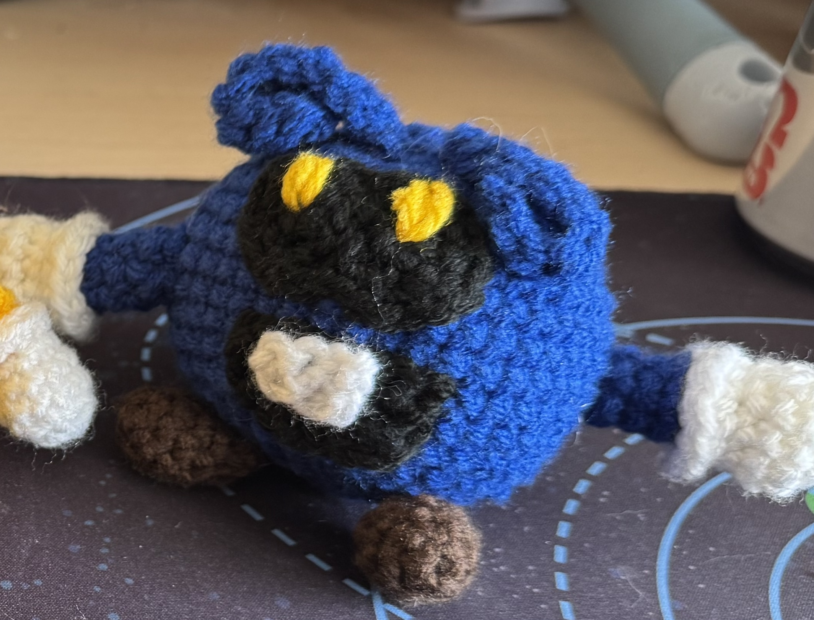
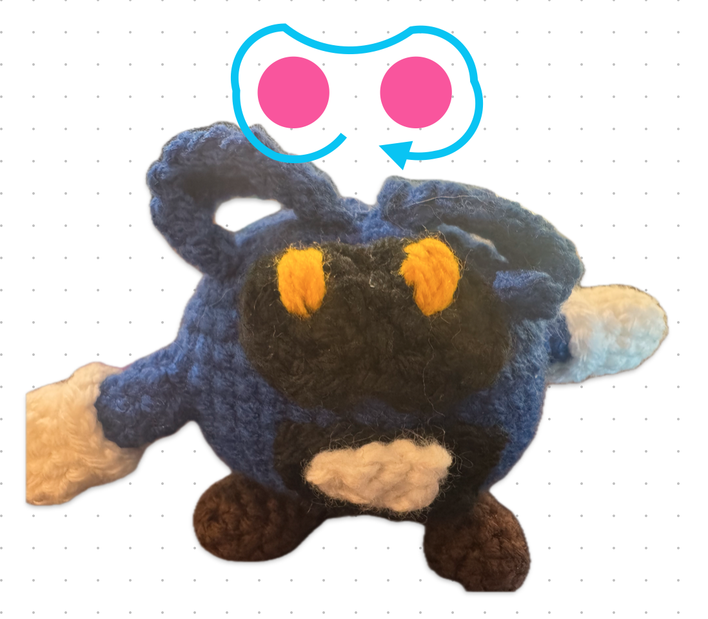

# Dr. Mario Viruses

My mom's favorite video game of all time is Dr. Mario for the Nintendo 64. We've spent quite a few hours playing that game, even prompting my grandparents to buy a Nintendo Switch just to play this game. So, for mom's birthday this year, I crocheted the viruses from this ["Dr. Mario and His Viruses" pattern](https://www.ravelry.com/patterns/library/dr-mario-and-his-viruses), and made a couple changes.

## Felt-less Guide

This is mostly just my bias, and because I don't really have felt at home, but I like avoiding felt in my projects. This is how I crocheted alternitives for the faces.

### Blue Virus

#### Eye Blacks (?)

Circles (Make 2)
1. 6sc in magic circle
2. Finish off (on second circle, do *not* finish off)

Now, join the two circles together into a 8-shape
* From the second magic circle, `sc` to connect to the next stitch on the *first* circle, then do `4inc` around the first circle
* `sc` from the first circle back to the remainging stitch on the second circle, then `4inc` again 
* Finish off

Then, do [the standard embroidery eyes](https://youtu.be/0O7EM_nRuoQ) for the pupils. I find this easier to do *after* sewing on the eye background.

#### Mouth

In black,
1. 4ch, turn
2. starting in second ch from hook, 3inc, ch and turn
3. 3[sc, inc], chain and continue on the "edge"
4. 7sc in the side posts, across the top of the mouth

#### Tooth

In white,
1. 4ch, turn
2. 3sc, finish off

Sew tooth onto the mouth before sewing the mouth onto the body

### Red Virus

#### Eye Hole/Mouth

In black, make 2 (one will be the eyes, the other will be the mouth)
1. ch 11 and turn
2. In second ch from hook: 3sc, inc, sc, inc, 3sc, inc
3. Rotate the chain 180°, and starting from the same chain the last inc of the last row went in: inc, 8sc, inc

#### Eyes

On one black bean-shape piece, in yellow do a pair of [dot embroidery eyes](https://youtu.be/pa4h9g2N6ts) for the pupils. Sew the eyes to the body

#### Mouth

In white, do [the standard embroidery eyes](https://youtu.be/0O7EM_nRuoQ) horizontally for the teeth. Sew the mouth onto the body.

In pink, make a tongue by making a 6sc magic circle, and sewing the center onto the body in the appropriate spot. 

In black, embroider a single black stitch for the tongue crease

### Yellow Virus

This is where I departed the most from the instructions. I couldn't figure out how to make an eye shape that matched the felt instructions and so instead I decided to incorporate the cheeks and nose from the original design of the virus

In black, make another eye-bean
1. ch 11 and turn
2. In second ch from hook: 3sc, inc, sc, inc, 3sc, inc
3. Rotate the chain 180°, and starting from the same chain the last inc of the last row went in: inc, 8sc, inc

Sew the eyes onto the body.

In yellow, make 2 cheek pieces
1. 6sc in a magic circle (6)
2. 6inc (12)
3. 12sc (12)
4. 12sc (12)

In yellow, make 1 nose piece
1. 6sc in a magic circle (6)
2. 3[sc, inc] (9)
3. 9sc (9)

Sew the nose and cheek pieces onto the face, overlapping the eye piece. I also used a couple stitches to sew the sides of the nose onto each adjacent cheek piece.

In orange, do a pair of [dot embroidery eyes](https://youtu.be/pa4h9g2N6ts) for the pupils.

[Optional] If you want, you could outline the mouth shape with a couple black embroidery stitches, but I didn't think it was necessary.

## Other Changes

### Body

* [Like most of my projects](./better-spheres.md), I like to alternate where I put my increases and decreases to avoid having these spheres have a hexagonal shape. This is inspired by the way [Okla Novytska writes her patterns](https://www.ravelry.com/patterns/library/nativity-minis-joseph-mary-jesus-lamb). A quick example is that for a row where the instruction is something like: `3[4sc, inc]`, I like to instead do `3[2sc, inc, 2sc]` (which you could also write `2sc, inc, 2[4sc, inc], 2sc`). And I only do this on rows with instructions of `Nsc, inc` where N is even. Rows where N is odd I leave alone.

I did this for each of the virus' bodies.

### Hands

I found it hard to do the `(FLO) (2sc, increase) around (12)` step and then find the hidden back loops, so instead, I did this starting at step 4

* (2sc, decrease) around, switch to the matching body color (9)
* In the body color, using back loops only, do {BLO}(sc, decrease) around (6)
* sc for three rows (6)
* Finish off
* Afterwards, come back in white and in the exposed white front loops, do (2sc, inc) around (12)
* Do an [invisible fasten off](https://youtu.be/Yc-rgg1I67s), linking back to the first white stitch in this row