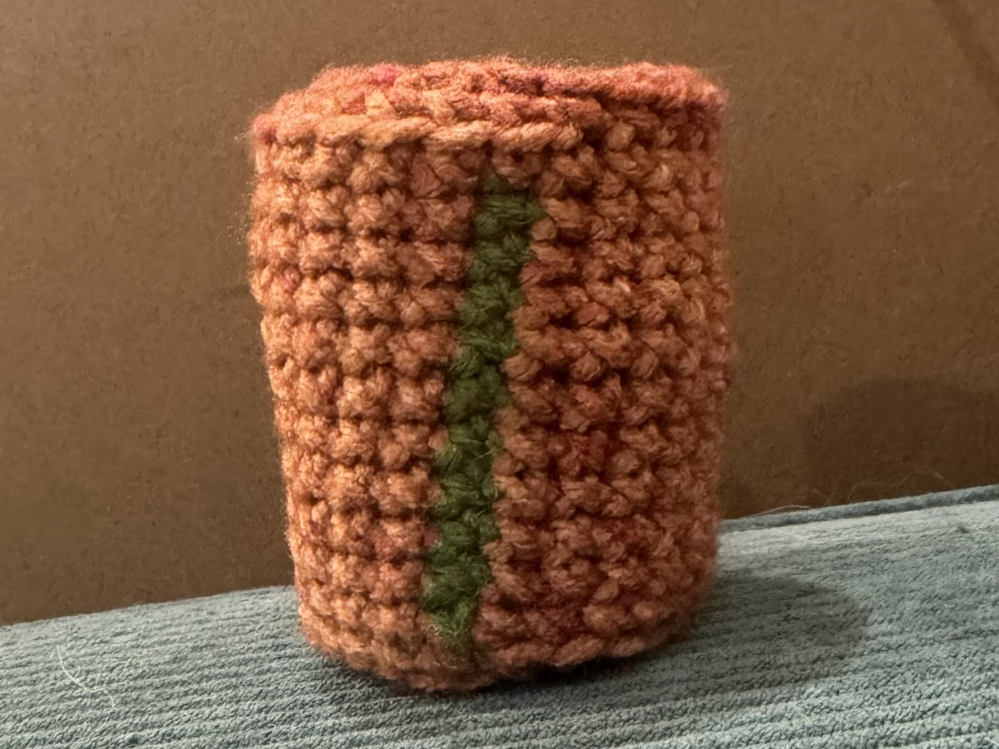

# Orcane

[[toc]]

## Yarn

insert picture here

## Stitches

| Abbr.                     | Description                                                                                                                                                                                                                                                                 |
| ------------------------- | --------------------------------------------------------------------------------------------------------------------------------------------------------------------------------------------------------------------------------------------------------------------------- |
| sl st                     | [Slip stitch](https://youtu.be/8ir3v31G0sg)                                                                                                                                                                                                                                 |
| sc                        | [Single crochet](https://youtu.be/7FcRdxg0aeY)                                                                                                                                                                                                                              |
| dc                        | [Double crochet](https://youtu.be/a1whu6Gub1M)                                                                                                                                                                                                                              |
| inc                       | Increase - This pattern was written with [invisible increases](https://youtu.be/TsIsuh54kCA) (where the first stitch is FLO) in mind, but [normal increases](https://youtu.be/CvD1qrrRX5c) work also                                                                        |
| 3sc&nbsp;in&nbsp;1        | 3 single crochets into the same stitch                                                                                                                                                                                                                                      |
| 4sc&nbsp;in&nbsp;1        | 4 single crochets into the same stitch                                                                                                                                                                                                                                      |
| dec                       | Decrease - This pattern was written with [invisible decreases](https://youtu.be/lZ8qHGQDT6Y) in mind (where you yarn through the front loops of each of the two stitches, and single crochet them together), but [normal decreases](https://youtu.be/ZXsiVk52_vA) work also |
| sc3tog                    | [Single crochet 3 together](https://youtu.be/EwlGDxRBOGE) - I wouldn't recommend doing this "invisibly"                                                                                                                                                                     |
| sc4tog                    | Single crochet 4 together                                                                                                                                                                                                                                                   |
| bo                        | [Bobble stitch](https://youtu.be/86G8f3MENVg)                                                                                                                                                                                                                               |
| BLO\{X, Y, Z\}            | Back-loops only - Do the stitches "X, Y, Z" in back loops only                                                                                                                                                                                                              |
| in same stitch\{X, Y, Z\} | Work each stitch "X, Y, Z" into the same stitch                                                                                                                                                                                                                             |

## Body

1. **In blue:** 6sc in a magic circle (6)
2. **white:** 2sc, **blue:** inc, 2sc, inc
3. **white:** 2inc, **blue:** 6inc (16)
4. **white:** 2[sc, inc], **blue:** 4[sc, inc, sc] (22)
5. **white:** 5sc, inc, **blue:** 2[7sc, inc] (25)
6. **white:** 3sc, inc, 3sc, **blue:** 17sc, inc (27)
7. **white:** 9sc, **blue:** 8sc, inc, 8sc, **white:** sc (28)
8. 7sc, inc, 2sc, **blue:** 17sc, **white:** inc (30)
9. sc, move the stitch counter as if this were the last stitch in row 8[\[1\]](#_1)
10. 10sc, **blue:** 9sc, inc, 8sc, **white:** 2sc (31)
11. 10sc, **blue:** 20sc, **white:** sc (31)
12. 4sc, inc, 5sc, **blue:** 20sc, **white:** sc (32)
13. 10sc **blue:** 22sc (32)
14. **white:** 9sc, inc, **blue:** 10sc, dec, 10sc (32)
15. **white:** 11sc, **blue:** 19sc, dec (31)
16. **white:** sc, move the stitch counter[\[1\]](#_1)
17. 5sc, inc, 5sc, **blue:** 20sc (32)
18. **white:** 12sc, **blue:** 9sc, dec, 9sc (31)
19. **white:** 12sc, **blue:** 17sc, dec (30)
20. **white:** 11sc, inc, **blue:** 2[7sc, dec] (29)
21. **white:** 13sc, **blue:** 7sc, dec, 7sc (28)
22. **white:** 13sc, **blue:** 2[5sc, dec], sc (26)
23. sc, move the stitch counter[\[1\]](#_1)
24. **white:** 13sc, **blue:** 2[2sc, dec, 2sc], sc (24)
25. **white:** 13sc, **blue:** 2[3sc, dec], sc (22)
26. **white:** 13sc, **blue:** 2[sc, dec, sc], sc (20)
27. sc, **white:** 11sc, **blue:** 6sc, dec (19)
28. 2sc, **white:** 8sc, **blue:** sc, dec, 2sc, dec, 2sc (17)
    - Stuff object
29. 2sc, **white:** 3sc, dec, sc, **blue:** 7sc, dec (15)
30. sc, move the stitch counter[\[1\]](#_1)
31. sc, **white:** 3sc, (cut white) **blue:** 5sc, dec, 4sc (14)
32. 4sc, dec, 4sc, 3inc, sc (16)
33. 2dec, 4[sc, dec] (10)
34. 5sc, 2sc, inc, 2sc (11)
35. 2sc, move the stitch counter[\[1\]](#_1)
36. 2sc, inc, 2sc, 5sc, inc (13)
37. 5sc, inc, 7sc (14)
38. 3sc, inc, 3sc, 3sc, inc, 3sc (16)
39. 7sc, inc, 8sc (17)
40. 7sc, dec, 8sc (16)
    - Start right fin
41. sc, skip 7, sc, and continue clockwise in the round, 7sc (9)
42. 3[sc, dec] (6)
43. sl st, finish off, and weave tail to close

Starting from the stitches skipped in row 41:

41b. inc, 7sc, inc (9)\
42b. 3[sc, dec] (6)\
43b. sl st, finish off, and weave tail to close

## Front Legs

Make 2

1. **In pink:** 6sc in a magic circle (6)
2. **white:** 6inc (12)
3. 2inc, 5[sc, inc] (19)
4. BLO\{ 2[sc, inc, sc], 3sc \}, 4[ BLO\{ sc \}, bo ], BLO\{ 2sc \}
   - When doing the bobble stitches, do them **through both loops**!
5. 2[3sc, inc], 3[sc3tog], sc4tog (14)
6. 2[2sc, inc, 2sc], 4sc (16)
7. 2[5sc, inc], 2dec (16)
8. 14sc, 2inc (18)
9. 14sc, 2[sc, inc] (20)
10. sc, move the stitch counter as if this were the last stitch in row 9[\[1\]](#_1)
11. **blue:** 2[5sc, dec], 6sc (cut white) (18)
12. 18sc (18)
13. 2[2sc, dec, 2sc], 2[sc, dec] (14)
    - Lightly stuff the bottom of the foot (not the leg)
14. 2dec, 2[sc, dec], 2dec (8)
15. 2[sc, dec, sc] (6)
16. sl st, finish off, and weave tail to close

## Back Legs

Make 2

1. **In pink:** 6sc in a magic circle (6)
2. **blue:** 6inc (12)
3. 3[sc, inc], 2[2sc, inc] (17)
4. BLO\{ 2[2sc, inc], 3sc \}, 4[bo, BLO\{ sc \}]
   - When doing the bobble stitches, do them **through both loops**!
5. 14sc, dec, sc3tog (16)
6. 14sc, 2[4sc in 1] (22)
7. 14sc, **blue:** 2[3sc, inc] (24)
8. sc, **white:** sc, dec, 3sc, dec, 3sc, **blue:** dec, 10sc (cut white) (21)
9. 5dec, 11sc (16)
10. sc, move the stitch counter as if this were the last stitch in row 9[\[1\]](#_1)
11. 16sc (16)
12. 2[sc, dec], 4sc, dec, 4sc (13)
    - Lightly stuff the bottom of the foot (not the leg)
13. 2dec, 3[sc, dec] (8)
14. 2[sc, dec, sc] (6)
15. sl st, finish off, and weave tail to close

## Dorsal Fin

1. **In blue:** 6sc in a magic circle (6)
2. 2inc, 2[sc, inc] (10)
3. inc, 3sc in 1, 8sc (13)
4. inc, 2[sc, inc], 8sc (16)
5. 2[3sc, inc], 3sc, dec, 3sc (17)
6. 9sc, inc, 5sc, dec (17)
7. sl st and finish off, leaving a tail for sewing

## Eye Details

Make 2

1. **In white:** 6sc in a magic circle (6)
2. inc, in same stitch\{sc, 2dc, sc\}, 2inc, in same stitch\{sc, 2dc, sc\}, inc
3. sl st and finish off, leaving a tail for sewing

## Circle Details

Make 4

1. **In white:** 6sc in a magic circle (6)
2. sl st and finish off, leaving a tail for sewing

## Assembly

Sew on legs in these positions

<!-- add pic -->

Attach them to the body here as well

<!-- add pic -->

Sew on the eye details here

<!-- add pic -->

Sew a circle on each front leg

<!-- add pic -->

And a circle behind each back leg

<!-- add pic -->

Sew the dorsal fin on here

<!-- add pic -->

Embroider 4 toe beans, in pink, on each foot

<!-- add pic -->

Embroider the eyes: 4 black stitches, 3 yellow stitches, 1 more black stitch

<!-- add pic -->

## Footnotes

### [1]

Most amigurumi tends to slowly spiral over time, and this can vary with tension, hook size, yarn size, etc. To keep each half of a shape even, for me it works best to add this "bonus stitch" every 6 rows. If your tension is higher, you could do this more often (every 5 or 4 rows). If your tension is looser, you could do this less often (every 7 to 8 rows). If you have perfect tension, you can omit this entirely.

> What my tension looks like if the first stitch of each row is green
