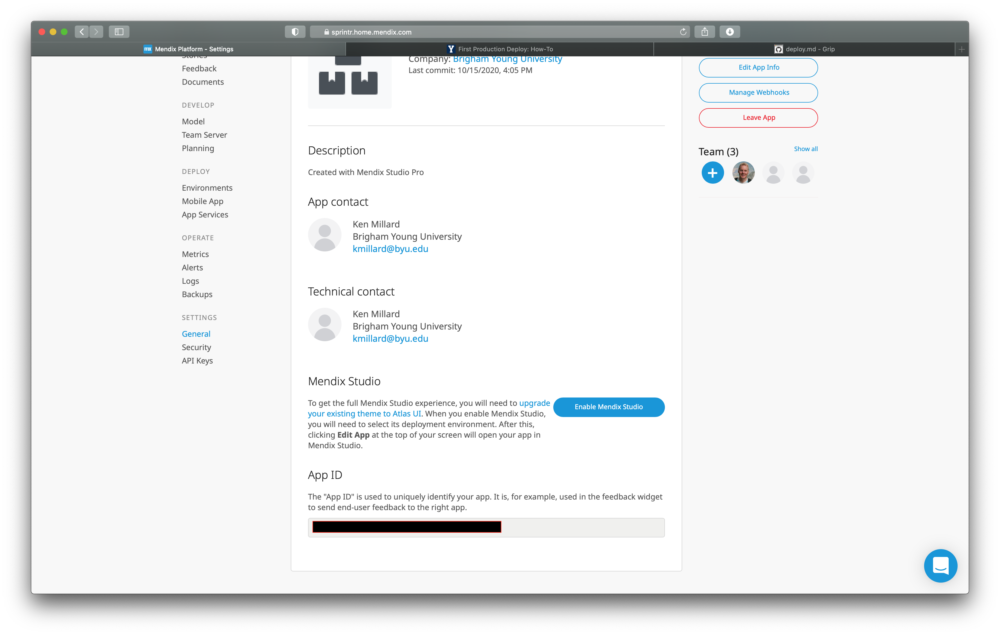

# First Production Deploy: How-To
##### This is an annotated version of [this article](https://mendix.byu.edu/first-production-deploy-how-to), crafted just a bit to the FHSS web team's needs.

1. Migrate to a licensed node
    1. The first thing that you're going to need is a "licensed node." You've probably been developing with a free node so far. In order to do this, send an email to [websitessupport@byu.edu](mailto:websitessupport@byu.edu) containing the following information: (Alternatively, you can just send a message in [BYU Web's](https://byu-web.slack.com) `#mendix-user-group` slack channel, saying that you'd like to get a licensed node and then Lauren or Paul or someone will DM you from there and you can give them the infos directly)
        * Your apps name
        * The technical contact's name
            * Submit this as your own name, as it will make developing and deploying the app easier. You'll have to change it back to Ken once it's been deployed, but keep it as yourself for now.
        * The technical contact's email
        * The project ID
            * This can be found on your apps dashboard page. (Found at [sprintr.home.mendix.com](https://sprintr.home.mendix.com/index.html)). Look at the menu on the left > "Settings" > "General" > Scroll to the bottom. I've covered mine up.

        * The requested URL
            * Starting out, your app should live at something like `byu-{Your app name}.mendixcloud.com`. You can set a custom domain by following [these steps](https://docs.mendix.com/developerportal/deploy/custom-domains).
    2. After you're done with that, you may have to wait a bit. (From the [docs](https://mendix.byu.edu/first-production-deploy-how-to):)
        > Licensed nodes are usually provisioned within 24 hours unless we are out of them and need to order more.
    3. From the docs again:
    > At [sprintr.home.mendix.com](https://sprintr.home.mendix.com/) invite the Website Support [websitessupport@byu.edu](mailto:websitessupport@byu.edu) user to the app with the Application Operator role so that your app will be automatically tracked in the CMDB and so we can know how much to budget each year for Mendix Cloud resource numbers and costs. BYU pays for these resources not your department.
    4. Now you need to migrate the actual project itself to the licensed node. Instructions on how to do that can be found [here](https://docs.mendix.com/developerportal/deploy/licensing-apps#licensed-node).
2. Setting up a byu.edu subdomain:
    * The instructions for setting up the custom domain in Mendix are found [here] FIXME: add this later

TODO:: How to move the project itself
TODO:: How to move to production from there
TODO:: How to change technical contact
